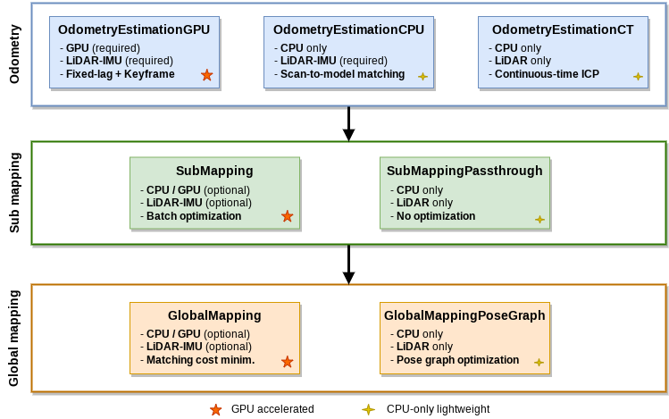

## Introduction

**GLIM** is a versatile and extensible range-based 3D mapping framework.

- ***Accuracy:*** GLIM is based on direct multi-scan registration error minimization on factor graphs that enables to accurately retain the consistency of mapping results. GPU acceleration is supported to maximize the mapping speed and quality.
- ***Easy-to-use:*** GLIM offers an interactive map correction interface that enables the user to manually correct mapping failures and easily refine mapping results.
- ***Versatility:*** As we eliminated sensor-specific processes, GLIM can be applied to any kind of range sensors including:
    - Spinning-type LiDAR (e.g., Velodyne HDL32e)
    - Non-repetitive scan LiDAR (e.g., Livox Avia)
    - Solid-state LiDAR (e.g., Intel Realsense L515)
    - RGB-D camera (e.g., Microsoft Azure Kinect)
- ***Extensibility:*** GLIM provides the global callback slot mechanism that allows to access the internal states of the mapping process and insert additional constraints to the factor graph. We also release [glim_ext](https://github.com/koide3/glim_ext) that offers example implementations of several extension functions (e.g., explicit loop detection, LiDAR-Visual-Inertial odometry estimation).

**Documentation: [https://koide3.github.io/glim/](https://koide3.github.io/glim/)**  
**Docker hub:** [koide3/glim_ros1](https://hub.docker.com/repository/docker/koide3/glim_ros1/tags), [koide3/glim_ros2](https://hub.docker.com/repository/docker/koide3/glim_ros2/tags), [ROS1 on Jetpack 5.1.4](https://hub.docker.com/r/junekyoopark/arm64v8_glim_ros1_cuda12.2) (made by [junekyoopark](https://github.com/junekyoopark))  
**Related packages:** [gtsam_points](https://github.com/koide3/gtsam_points), [glim](https://github.com/koide3/glim), [glim_ros1](https://github.com/koide3/glim_ros1), [glim_ros2](https://github.com/koide3/glim_ros2), [glim_ext](https://github.com/koide3/glim_ext)

Tested on Ubuntu 22.04 /24.04 with CUDA 12.2 / 12.5 / 12.6, and NVIDIA Jetson Orin (Jetpack 6.1).

If you find this package useful for your project, please consider leaving a comment [here](https://github.com/koide3/glim/issues/19). It would help the author receive recognition in his organization and keep working on this project.

[](https://github.com/koide3/glim/actions/workflows/build.yml)
[](https://github.com/koide3/glim_ros1/actions/workflows/build.yml)
[](https://github.com/koide3/glim_ros2/actions/workflows/build.yml)
[](https://github.com/koide3/glim_ext/actions/workflows/build.yml)

## Dependencies
### Mandatory
- [Eigen](https://eigen.tuxfamily.org/index.php)
- [nanoflann](https://github.com/jlblancoc/nanoflann)
- [GTSAM](https://github.com/borglab/gtsam)
- [gtsam_points](https://github.com/koide3/gtsam_points)

### Optional
- [CUDA](https://developer.nvidia.com/cuda-toolkit)
- [OpenCV](https://opencv.org/)
- [OpenMP](https://www.openmp.org/)
- [ROS/ROS2](https://www.ros.org/)
- [Iridescence](https://github.com/koide3/iridescence)

## Gallery

See more at [Video Gallery](https://github.com/koide3/glim/wiki/Video-Gallery).

| Mapping with various range sensors | Outdoor driving test with Livox MID360 |
|---|---|
|[](https://www.youtube.com/watch?v=_fwK4awbW18)|[](https://www.youtube.com/watch?v=CIfRqeV0irE)|

| Manual loop closing | Merging multiple mapping sessions |
|---|---|
|||

| Object segmentation and removal |  |
|---|---|
|| |

## Estimation modules

GLIM provides several estimation modules to cover use scenarios, from robust and accurate mapping with a GPU to lightweight real-time mapping with a low-specification PC like Raspberry Pi.



## Thirdparty works using GLIM

If you are willing to add your work here, feel free to let me know in [this thread](https://github.com/koide3/glim/issues/19) :)

- [kamibukuro5656/MapCleaner_Unofficial](https://github.com/kamibukuro5656/MapCleaner_Unofficial)

## License

This package is released under the MIT license. For commercial support, please contact ```k.koide@aist.go.jp```.

If you find this package useful for your project, please consider leaving a comment [here](https://github.com/koide3/glim/issues/19). It would help the author receive recognition in his organization and keep working on this project. Please also cite the following paper if you use this package in your academic work.

## Related work

Koide et al., "GLIM: 3D Range-Inertial Localization and Mapping with GPU-Accelerated Scan Matching Factors", Robotics and Autonomous Systems, 2024, [[DOI]](https://doi.org/10.1016/j.robot.2024.104750) [[Arxiv]](https://arxiv.org/abs/2407.10344)

The GLIM framework involves ideas expanded from the following papers:  
- (LiDAR-IMU odometry and mapping) "Globally Consistent and Tightly Coupled 3D LiDAR Inertial Mapping", ICRA2022 [[DOI]](https://doi.org/10.1109/ICRA46639.2022.9812385)
- (Global registration error minimization) "Globally Consistent 3D LiDAR Mapping with GPU-accelerated GICP Matching Cost Factors", IEEE RA-L, 2021, [[DOI]](https://doi.org/10.1109/LRA.2021.3113043)
- (GPU-accelerated scan matching) "Voxelized GICP for Fast and Accurate 3D Point Cloud Registration", ICRA2021, [[DOI]](https://doi.org/10.1109/ICRA48506.2021.9560835)

## Contact
[Kenji Koide](https://staff.aist.go.jp/k.koide/), k.koide@aist.go.jp<br>
National Institute of Advanced Industrial Science and Technology (AIST), Japan

