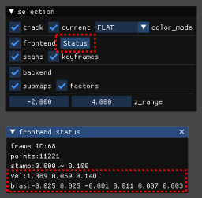

# FAQ

## IMU-related issues

If you face troubles, which may be related to IMU (e.g., estimation gets degraded when the LiDAR rotates), try the [imu_validator](https://github.com/koide3/glim_ext/tree/master/modules/odometry/imu_validator) module to see if the LiDAR-IMU transformation is properly calibrated.

This module plots the linear acceleration vector in the world frame (which should be around [0, 0, +g] regardless of the LiDAR pose) and the angular velocity estimated by LiDAR and IMU (they should be similar and synchronized).

<div class="youtube">
<iframe width="560" height="315" src="https://www.youtube.com/embed/tsOJHTObuqY" title="YouTube video player" frameborder="0" allow="accelerometer; autoplay; clipboard-write; encrypted-media; gyroscope; picture-in-picture" allowfullscreen></iframe>
</div>

!!!tip
    To enable this extension module, you need to build [glim_ext](https://github.com/koide3/glim_ext) along with GLIM and add ```"libimu_validator.so"``` to [```"glim_ros/extension_modules"```](https://github.com/koide3/glim/blob/36cccb3851100f8d351874f81720dbe577b0cc81/config/config_ros.json#L11) in [```config_ros.json```](https://github.com/koide3/glim/blob/master/config/config_ros.json). The validation GUI will appear on the standard viewer of GLIM.

You can also check if IMU velocity and bias are properly estimated by clicking the Status button in the standard viewer. If the bias values are too large (> 0.5) or too frequently changed, the IMU may not be well synchronized and calibrated with the LiDAR.




## The created map is tilted

Because the initial upward direction (gravity direction) of the map frame is simply estimated by the average of linear acceleration observations, and you must keep the sensor at rest for the first a few seconds.

!!!tip
    You can manually provide an initial gravity-aligned sensor pose by specifying ```odometry_estimation/init_T_world_imu``` in ```config_odometry_*.json``` to skip the initial state estimation.


## error: function "omp_is_initial_device" has already been defined

Clang-14 causes ```omp_is_initial_device```-related build errors when compiling CUDA codes. The error can be suppressed by commenting out the line causing it in ```omp.h``` (L496 of ```/usr/lib/llvm-14/lib/clang/14.0.0/include/omp.h``` in my case).  
(This is not an elegant solution of course, and I think we should just use gcc to avoid this error.)